Notes Summarized for the Workshop held between 18th June and 1st July 2025
## [Day 1 - Inception of open-source EDA, OpenLANE and sky130 PDK](day-1---inception-of-open-source-eDA-,-openLANE-and-sky130-pDK)
### How to talk to computers
1. Introduction to QFN-48 Package, chip, pads, core, die and IPs
2. Introduction to RISC-V
3. From Software Applications to Hardware
### Soc design and OpenLANE
1. Introduction to all components of open-source digital asic design
2. Simplified RTL2GDS flow
3. Introduction to OpenLANE and Strive chipsets
4. Introduction to OpenLANE detailed ASIC design flow
### Get familiar to open-source EDA tools
1. OpenLANE Directory structure in detail
2. Design Preparation Step
3. Review files after design prep and run synthesis
4. OpenLANE Project Git Link Description
5. Steps to characterize synthesis results
## Day 2 - Good floor planning considerations
### Chip Floor planning consideration
1. Utilization factor and aspect ratio
2. Concept of pre-placed cells
3. De-coupling capacitors
4. Power planning
5. Pin placement and logical cell placement blockage
6. Steps to run floorplan using OpenLANE
7. Review floorplan files and steps to view floorplan/a>
8. Review floorplan layout in Magic
### Library building and Placement
1. Netlist binding and initial place design
2. Optimize placement using estimated wire-length and capacitance
3. Final placement optimization
4. Need for libraries and characterization
5. Congestion aware placement using RePlAce
### Cell design and characterization flows
1. Inputs for cell design flow
2. Circuit design steps
3. Layout design step
4. Typical characterization flow
### General timing characterization parameters
1. Timing threshold definitions
2. Propagation delay and transition time
## Day 3 - Design library cell using Magic Layout and ngspice characterization
### Labs for CMOS inverter ngspice simulations
1. IO placer revision
2. SPICE deck creation for CMOS inverter
3. SPICE simulation lab for CMOS inverter
4. Switching Threshold Vm
5. Static and dynamic simulation of CMOS inverter
6. Lab steps to git clone vsdstdcelldesign
### Inception of layout ̂A CMOS fabrication process
1. Create Active regions
2. Formation of N-well and P-well
3. Formation of gate terminal
4. Lightly doped drain (LDD) formation
5. Source-drain formation
6. Local interconnect formation
7. Higher level metal formation
8. Lab introduction to Sky130 basic layers layout and LEF using inverter
9. Lab steps to create std cell layout and extract spice netlist
### Sky130 Tech File Labs
1. Lab steps to create final SPICE deck using Sky130 tech
2. Lab steps to characterize inverter using sky130 model files
3. Lab introduction to Magic tool options and DRC rules
4. Lab introduction to Sky130 pdk's and steps to download labs
5. Lab introduction to Magic and steps to load Sky130 tech-rules
6. Lab exercise to fix poly.9 error in Sky130 tech-file
7. Lab exercise to implement poly resistor spacing to diff and tap
8. Lab challenge exercise to describe DRC error as geometrical construct
9. Lab challenge to find missing or incorrect rules and fix them
## Day 4 - Pre-layout timing analysis and importance of good clock tree
### Timing modeling using delay tables
1. Lab steps to convert grid info to track info
2. Lab steps to convert magic layout to std cell LEF
3. Introduction to timing libs and steps to include new cell in synthesis
4. Introduction to delay tables
5. Delay table usage Part 1
6. Delay table usage Part 2
7. Lab steps to configure synthesis settings to fix slack and include vsdinv
### Timing analysis with ideal clocks using openSTA
1. Setup timing analysis and introduction to flip-flop setup time
2. Introduction to clock jitter and uncertainty
3. Lab steps to configure OpenSTA for post-synth timing analysis
4. Lab steps to optimize synthesis to reduce setup violations
5. Lab steps to do basic timing ECO
### Clock tree synthesis TritonCTS and signal integrity
1. Clock tree routing and buffering using H-Tree algorithm
2. Crosstalk and clock net shielding
3. Lab steps to run CTS using TritonCTS
4. Lab steps to verify CTS runs
### Timing analysis with real clock using openSTA
1. Setup timing analysis using real clocks
2. Hold timing analysis using real clocks
3. Lab steps to analyze timing with real clocks using OpenSTA
4. Lab steps to execute OpenSTA with right timing libraries and CTS assignment
5. Lab steps to observe impact of bigger CTS buffers on setup and hold timing
## Day 5 -Final step for RTL2GDS using tritinRoute and openSTA
### Routing and design rule check (DRC)
1. Introduction to Maze Routing-Lee’s algorithm
2. Lee’s Algorithm conclusion
3. Design Rule Check
### Power Distribution Network and routing
1. Lab steps to build power distribution network
2. Lab steps from power straps to std cell power
3. Basics of global and detail routing and configure TritonRoute
### TritonRoute Features
1. TritonRoute feature 1 - Honors pre-processed route guides
2. TritonRoute Feature2 & 3 - Inter-guide connectivity and intra- & inter-layer routing
3. TritonRoute method to handle connectivity
4. Routing topology algorithm and final files list post-route
## References
## Acknowledgement

# Day 1 - Inception of open-source EDA, OpenLANE and sky130 PDK
## How to talk to computers
### Introduction to QFN-48 Package, chip, pads, core, die and IPs

  

  This is an Arduino Uno board, which is a microcontroller as it features a microprocessor, memory, and other Ports for input and output. The chip encircled by a yellow circle is called a processor.
  The design of this chip from the abstract level down to the fabrication is done by RTL to GDSll flow.
    

  

 
The above image shows different components of the microcontroller board having different SDRAM memories, JTAG, and UART protocols along with SoC/Processor.
  

  

The above image shows different I/O ports associated with the QFN package.
  

  

The above image shows that different I/O ports associated with the QFN package are wire bonded to the Chip.
  

  

Chip components:
<ul>
  <li>Pads: Through which we can send the signal inside the chip, I/O ports are made here. </li>
  <li> Core: Place where all the logic blocks are placed. </li>
   <li> Die: the chip is placed in this physical area, which is utilized based on the requirements. </li>
</ul>
  
 

  

The aboce image shows different parts that makes a working chip which consists of PLL,ADC,DAC RISC-V SoC,SRAM which can be classified in :
<ul>
  <li><b> Macros:</b> Predefined functional Blocks that can be used for creating certain logic.For example :RISC-V Soc Architecture, SPI </li>
   <li><b>IPs:</b> Intellectual Property, which is outsourced from vendors and is fully optimized to be used in the Chip, as it is not necessary to make these designs again and again.For example, SDRAM,PLL,ADC,DAC</li>
</ul>

### Introduction to RISC-V
RISC-V ISA (Instruction Set Architecture)
This stands for Reduced Instruction Set Computer V, where V means the generation.
It is an open-source, free-to-use architecture type that supports 32, 64, and 128-bit architectures.

  

The above image shows the C code and how it is implemented in the Picorv32 processor and the physical Layout of the Chip

### From Software Applications to Hardware
Application Software runs on Hardware, they communicate with each other via System software (Operating System), which converts the High-level language Code to low-level Language code and then into assembly, which is then converted into binary digits that the Computer understands.

  

So for a Simple code of a watch written in the C language, the compiler compiles the code and makes it in assembly language, which is then given to an assembler to be decoded into binary Language. 

In the image, we can see the RISC-V instruction set that will be implemented on the hardware, given is the physical Layout of the same.

All the code is to be written in this Course.

These Instructions act as an <b>abstract interface</b> between the C language and Hardware.
 

There is another Interface between Instruction Set and Hardware that is needed, and it is called Hardware Descriptive Language, as Hardware only understands 1s and 0s. 
RTL Language implements the instructions, and it is called RTL Implementation of Instruction Set.

## Soc design and OpenLANE
### 1. Introduction to all components of open-source digital ASIC design

Digital ASIC Design Flow is made of three components:
<ul>
<li>RTL IP's</li>
<li>EDA tools</li>
<li>PDK's</li>
</ul>
For making an open-source ASIC Design, all these are required.

### RTL IPs
RTL IPs—short for Register Transfer Level Intellectual Properties—are reusable hardware design blocks described at the RTL abstraction level, typically using languages like Verilog or VHDL. These IPs are foundational in building complex digital systems like SoCs (System on Chips) and FPGAs.

### EDA Tools
Electronic Design Automation (EDA) tools are the digital backbone of modern chip and circuit design. They’re sophisticated software suites that help engineers design, simulate, verify, and prepare electronic systems—like integrated circuits (ICs) and printed circuit boards (PCBs)—for manufacturing.
Key Categories of EDA Tools
<ul>
<li><b>Schematic Capture: </b> Tools like OrCAD and KiCad let you draw circuit diagrams and define component connections.</li>
<li><b>Simulation: </b> SPICE-based simulators (e.g., LTspice, HSPICE) model circuit behavior before physical prototyping.</li>
<li><b>Layout and PCB Design:  </b>Tools like Altium Designer, Cadence Allegro, and Eagle help design the physical layout of PCBs.</li>
<li><b>RTL Design and Synthesis:  </b>Tools such as Synopsys Design Compiler and Xilinx Vivado convert RTL code (Verilog/VHDL) into gate-level netlists.</li>
<li><b>Verification:  </b>UVM-based tools like Mentor Questa or Cadence Xcelium simulate and verify logic correctness.</li>
<li><b>Physical Design and DRC/LVS: </b> Tools like Cadence Innovus and Synopsys IC Compiler handle placement, routing, and design rule checks.</li>
<li><b>Timing and Power Analysis: </b> PrimeTime and Voltus analyze timing closure and power consumption.</li>
</ul>ul>

### What is a PDK?

PDK is the Process Design Kit given by the foundry, which has all the information on how the chip is to be designed, and these are manufacturable as per the foundry's process Technology.

These tools and technologies will be used in this project implementation.

130nm Technology is still used for various applications when the critical need is not speed.

Typical ASIC Design requires these many EDA tools processes for successful tape-out.

### 2. Simplified RTL2GDS flow

The RTL to GSDII Flow has numerous steps that need to be performed to transition RTL-generated code to Tape-Out.
The major steps involved are :
<ul>
  <li><b>Synthesis</b></li>
  <li><b>Floor Planning/Power Planning</b></li>
   <li><b>Placement</b></li>
   <li><b>Clock Tree Synthesis</b></li>
   <li><b>Routing</b></li>
   <li><b>Sign-Off</b></li>
   
</ul>

### SYNTHESIS
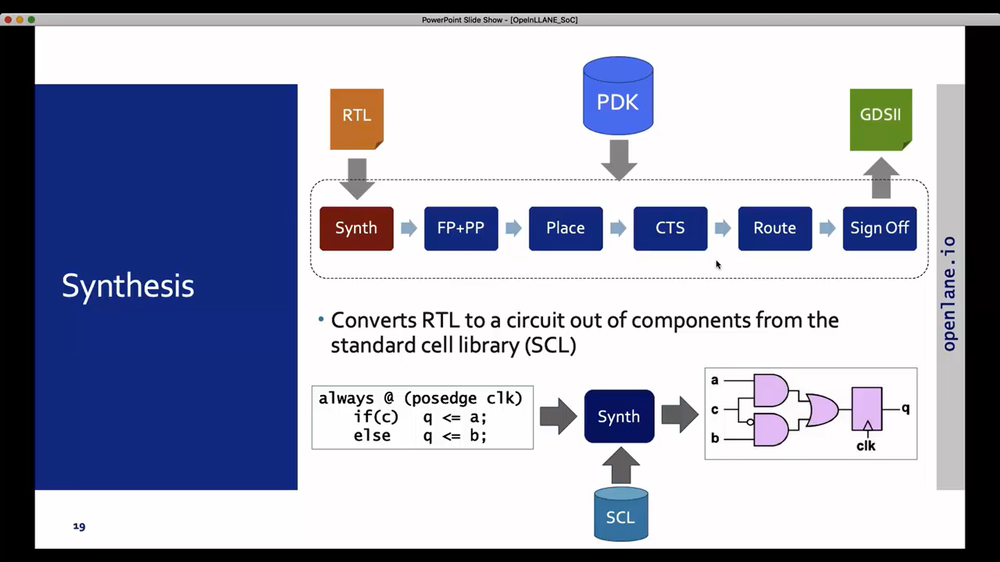
Converts the RTL code into a Gate-level Netlist that is made from a Standard Cell Library.

### FLOOR PLANNING / POWER PLANNING
This is the next step after the RTL is converted into a gate-level Netlist.
The placement of pre-placed cells is planned in Floor planning, and how different VDD and Ground wires will be connected in a mesh is decided in this step.

Partition is done in the chip for different components such as I/O Pads, CPU, SRAM, DRAM, etc.

The image shows the multiple power lines as a mesh structure, so all the components of the Chip get Voltage and ground lines, and there is no Voltage Droop and Ground Bounce. 
### PLACEMENT

Placement Step is divided into two parts:
<ul>
  <li>Global Placement</li>
  <li>Detailed Placement</li>
</ul>
In <b>Global Placement</b>, the gates or Flops that are taken from SCL are placed onto the Chip, which can be illegal according to the DRC rules, as these are placed to check whether the blocks will get power and the signal integrity is maintained or not, and this is just for optimized placement.
In <b>Detailed Placement</b>, the blocks are placed correctly such that there is no illegal placement according to DRC Rules.

### CLOCK TREE SYNTHESIS
In this Step Clock Tree is created such that all the Blocks get a clock pulse at the same time, if the circuit operates in that way, or the clock pulse should reach without any Delay and with good signal integrity.
This helps us understand where a buffer needs to be placed.

### ROUTING

In this step, we perform routing so that every block receives the signal with good signal strength and, at the same time, ensures that each block works correctly.

Divided into two sections: Global routing and Detailed Routing.
### SIGN-OFF
After all these steps the design is finally ready for sign-off where different conditons are to be met:
<ul>
  <li>Physical Verification: DRS and LVS</li>
  <li>Timing Verification: Static Timing Analysis</li>

</ul>

### 3. Introduction to OpenLANE and Strive chipsets
OPENLANE is an automated RTL to GDSII flow that comprises several tools such as OpenROAD, Yosys, Magic, Netgen, Fault, CVC SPEF-Extractor, CU-GR, Klayout, etc. striVe is a family of open everything SoCs: Open PDK, Open EDA, Open RTL. 

<b>striVe SoC Family </b>

Different versions of striVe with each generation are better than the previous one.
### 4. Introduction to OpenLANE detailed ASIC design flow

OpenLANE ASIC design flow starts from RTL synthesis, which is done with <b>YoSys tool</b> and <b>abc for optimization</b>.

<b>Synthesis Optimizations iterations </b> 
After that, STA is done with the ideal clocks to check for the timings. After that, DFT is done, Design for Test using <b>Fault</b> software.  

After that, using OpenROAD floorplanning, placement, CTS, and Global Routing is done, followed by Detailed Routing using TritonRoute. 

<b>Every time the netlist is modified.(CTS modifies the netlist and Post Placements optimization also modifies the netlist).so for that verification must be performed. The LCE(yosys) is used to formally confirm that the function did not change after modifying the netlist.</b>
  
Fake antenna diodes are placed, as metal wires can act as an Antenna, which can create problems. 

 All this procedure is done till we reach an optimized design.
After we reach optimized design, we go for RC Extraction, then STA is done using OpenSTA as the parasitic RC has been extracted, and we can test the design with real clocks. After this, we do Physical and Timing Verification.

This completes the RTL to GDSII flow.

## Get familiar to open-source EDA tools
This section explains basic commands for the Terminal 
1. <b>cd </b>: Change directory
2.  <b>ls -ltr:  </b>gives the list of files and folders in the current directory.
3.  <b>less :  </b>Opens the file
4.  <b>pwd :  </b>Tells the current directory.
5.  <b>clear : </b> Clears the terminal screen.

### OpenLANE Directory structure in detail

This is the working directory for the project.

The PDK we using is Skywater 130nm and these are all the related files to the PDKs.

### Design Preparation Step
1. <b>docker : Used to get in the docker container.</b>
2. <b> ./flow.tcl -interactive : This command is used to get in the OpenLANE flow and interactive is used to do the RTL to GDSII flow step by step, as the whole process is automated if we do not use interactive.</b>
3. <b>package require openlane 0.9:</b> this command gets us in OpenLANE and the whole process of generating RTL to GDSII will be done in this.

we use the command <b> prep -design picorv32a </b> in the OpenLane to prepare the directory.

### Review files after design prep and run synthesis
runs folder is created in designs/picorv32a directory.

This is .lef file which tells about the size and locations of cells and consisting of all physical dimension information.

This is the <b>picorv32a .tcl</b> file, which tells about the specification of the design we are generating the whole flow for.

The <b>run_synthesis </b> command is used to run the synthesis.
### OpenLANE Project Git Link Description
This is the GitHub repository for the OpenLane project <b> https://github.com/efabless/OpenLane/blob/master/README.md </b>
### Steps to characterize synthesis results
Synthesis is done

1. Number of D flip flops : 1613

2. Number of cells = 14876  
3. <b>Flop ratio = 1613/14876 = 10.84% </b> 

The folder before was empty, but now it has results in the synthesis folder in the results directory.

# Day 2 - Good floor planning considerations
## Chip Floor planning consideration
### Utilization factor and aspect ratio 
Die is the cut-out silicon from the Silicon Wafer. This die consists of I/O pads and Core, where the whole logic blocks are placed.

The width and height of the Core and Die are chosen depending on the Netlist. A netlist describes the connectivity of an electronic design. We take the netlist and map the gates and flops into their physical dimensions, making blocks of them and placing them next to each other.  

Let us assume that a standard cell is 1 unit in width and height. So the area it consumes is 1 sq. unit.

So, for a netlist that consists of 2 gates and 2 flops, the area consumed would be 2*2 = 4 sq. units.  
<b>Utilization Factor </b> means how much the core is filled with the logic blocks, so for a 4 sq unit logic block, if the size of the core is 4 units in width and 2 in height, then the total area for the Core would be 16 sq units. 

So the Utilization factor  = 4/8, which is 50%. 
<b>Aspect Ratio</b> is the ratio of Height/width, so in this case it will be <b>2/4 = 0.5.</b>

### Concept of pre-placed cells

In VLSI physical design, pre-placed cells are special cells that are positioned before the automated placement stage begins. These aren’t your regular logic gates—they serve physical or structural purposes and are fixed in place to guide or protect the rest of the layout.
The most common types:

1. Well Tap Cells: Prevent latch-up by connecting wells to power/ground.
2. Endcap or Boundary Cells: Protect standard cells at the edges of rows from damage during manufacturing.
3. Spare Cells: Extra logic gates placed in advance for future ECO (Engineering Change Order) fixes.
4. Decap Cells: Help with power integrity by providing decoupling capacitance.
5. Clock Cells: Like clock buffers or muxes, often placed early due to strict timing needs.
6. Macros/IPs: Large blocks like SRAMs or PLLs that must be placed manually due to size and routing constraints.
These cells are usually marked as fixed, so the tool doesn’t move them during optimization. They help ensure a clean, manufacturable, and timing-friendly layout.
### Defining Location of Pre-placed Cell
  Big Combinational blocks are broken into small blocks so that they can be treated as individual blocks, which helps in optimization of the area.

 
  
   

    
### De-coupling capacitors
 
Decoupling capacitors, also referred to as bypass capacitors, are critical components in electronic circuits, particularly in digital and mixed-signal systems. Their primary function is to stabilize the power supply by mitigating voltage fluctuations and suppressing high-frequency noise.
When a digital integrated circuit (IC) undergoes rapid switching, it generates transient currents that can lead to undesirable voltage drops on the power rail. A decoupling capacitor, placed in close proximity to the IC’s power pins, acts as a localized energy reservoir. It supplies instantaneous current to the IC during switching events, thereby maintaining a stable voltage level.
A Decoupling Capacitor helps in providing a Voltage supply, as when the transistor switches from zero to one, it needs current, and it increases exponentially when logic switches from 0 to 1 for lot of transistors same for giving ground to all of them.
 
1. Noise margin High gives the range for which the signal is considered as 1 when noise is there.
2. Noise marhin Low gives the range for which the signal is considered as 0 when noise is there.
3. Signal in between this is considered random, and it can be either of them, so to avoid this scenario, we use decoupling capacitors.
 

### Power planning
Power planning is a fundamental phase in VLSI physical design that ensures reliable and efficient power delivery to all components—standard cells, macros, and I/O blocks—within an integrated circuit.
Objectives of Power Planning
1. Distribute power uniformly across the chip to avoid IR drop and electromigration.
2. Ensure sufficient power delivery to high-demand regions, especially near macros and clocking elements.
3. Optimize metal usage while maintaining design rules and minimizing congestion.
4. Key Elements of Power Planning
5. Power Pads: Interface between the external power source and the chip.
6. Trunks: Routes connecting power pads to the core rings.
7. Core Rings: Metal rings (VDD and VSS) surrounding the core, distributing power to the internal regions.
8. Power Stripes: Vertical and horizontal metal lines that carry power from the rings across the chip.
9. Power Rails: Metal 1-level connections that deliver power directly to standard cells.
10. Power Vias: Vertical connections between metal layers to ensure continuity in the power network.
This entire structure forms the Power Distribution Network (PDN), which is typically implemented before placement and routing to avoid congestion and ensure accurate IR drop analysis.

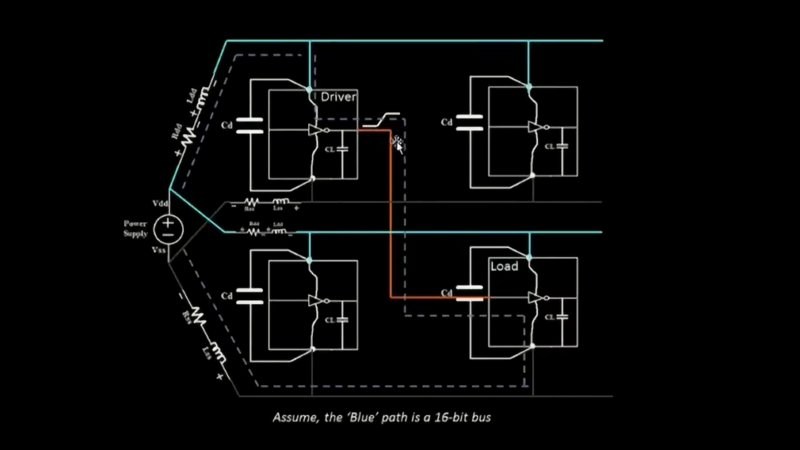 
When we use a Single Voltage supply and a Single ground line for the circuit, we have Voltage Droop and Ground bounce problems.

 
  
   

When Multiple logic switching is happening simultaneously, giving decoupling capacitor to every logic block is not practical solution so we come up with voltage and ground mesh like structure so that the block can take the voltage from nearby point and can drain the voltage into the ground from nearby area.
 

### Pin placement and logical cell placement blockage
Pin placement refers to the strategic positioning of input/output pins on the periphery of a block or chip. Good pin placement minimizes routing congestion and timing delays by aligning pins close to their logical connections. In hierarchical designs, pin locations might be dictated by top-level constraints, but sometimes block owners have the flexibility to optimize them locally.
Logical cell placement blockages, on the other hand, are regions where standard cells are restricted from being placed. These blockages help guide the placement tool to avoid congested or sensitive areas. There are two main types:
1. Hard blockages: Completely prohibit any cell placement.
2. Soft blockages: Allow only buffers or specific cell types, often used to reserve space for future routing or macro expansion.

The clock I/O port is bigger for less resistance, and these I/O ports can be placed in any order such that it optimizes the whole placement.It need not be in same line for one whole logic block.
 
Blocking of cell placement happens in the I/O pads region such that no block placement happens there.

### Steps to run floorplan using OpenLANE
To run Floorplan type the command <b>run_floorplan</b> and it will generate the floorplan.
 

### Review floorplan files and steps to view floorplan
To review the floor plan made,we will look into the ioPlacer.log file that is created in the <b>logs/floorplan</b> directory 
 
The below image shows the Die Area and the Utilization Factor of the Core.

 
  
   

In the <b>results/floorplan</b> Directory, we will type the following command to open the magic tool for seeing the floorplan.  

<b> magic -T /home/vsduser/Desktop/work/tools/openlane_working_dir/pdks/sky130A/libs.tech/magic/sky130A.tech lef read ../../tmp/merged.lef def read picorv32a.floorplan.def & </b>
This opens the magic tool with the Floorplan design.
 

### Review floorplan layout in Magic
Once we enter in Magic, we can zoom toa  particular cell by pressing the <b>left click and right click </b> to make a rectangle box and then pressing <b> Z key </b> zooms into the cell. 
<b>Shift +Z key </b> helps in zooming out.
 
The bottom black lines are the Standard cells that are not placed as in floorplan stage only pre placed cells are placed.
In Tkcon.tcl menu we can check the metal layer for the cell like we can see it is in metal 3 layer.
We can see the buffer that are placed along with the decap cells that are placed for pre placed cells.

## Library building and Placement

### Netlist binding and initial place design
Binding netlist to physical cells meaning that the logic gates and flops block diagrams have certain physical dimensions so we map them.

 
  
   

Physical Cells
 
Next step is placement where these physical cells are placed onto the floorplan in optimized way such that the input pin is close to the first physical cell and output pin is closest to last cells of the netlist.

 
  
   

### Optimize placement using estimated wire-length and capacitance
In this section,we will optimizing the placement by adding buffers for signal integrity and no time lag.

 
  
   

Addition of buffers depend on the mathematical equations that takes parasitic RC as its parameter which gives the delay and we get to know whether it needs a buffer or not.
 

### Final placement optimization
In this section more buffers are added keeping in mind the data slew check and estimate time required to reach the required capture flop.

 
  
   

For the final Netlist

 
  
   

### Need for libraries and characterization

Every ICdesign Flow needs to go through the several steps. First step to go through is Logic Synthesis, we have a functionality which is coded in a form of an RTL so we to convert the functionality into physical cells known as Logic Synthesis.Next step of logic synthesis is Floorplaning, We put the pre placed cells surrounded by decoupling capacitors in this step. The next step after floorplaning is Placement, in this we take the particular logic cell send place them on the chip in such a fashion that initial timing is better. Next step is CTS(Clock tree synthesis), We want every cell to get clock signal at same time so this step takes care of that.Next step is Routing, routing has to go through the certain flow dependendent on the characterization of the flip flop.And now comes the last step STA(Static timing analysis), in this we try to see the set up time, hold time, maximum achieved frequency of the circuit. One common thing across all stages 'GATES or Cells'.

 
  
   

### Congestion aware placement using RePlAce
In this section, we place the standard cells that were not placed before in the floorplanning stage.
 
Zoomed in view looks like this
The placement is donne in two stages. Global and detailed. In global placement, legalization is not there meaning the cells can overlap but it is done keeping the time as a constraint ,but after detailed placement legalization will be done.Main objective of global placement is to reducing the length of wires,we look at Half parameter wire length (HPW) in OpenLANE.Overflow value should decrease meaning the Placement is going right.
 
 

## Cell design and characterization flows

### Inputs for cell design flow
 
Image of a complete synthesised chip with placement and routing done.
 
These are called Standard cells.A library contains many standard cells like these.The library stores information about their physical dimensions, delay, Threshold Voltages, drive strength, etc.

 
  
   

Cell Design is divided in 3 steps:
1. Inputs :PDKs
2. Design Steps
3. Output

 
  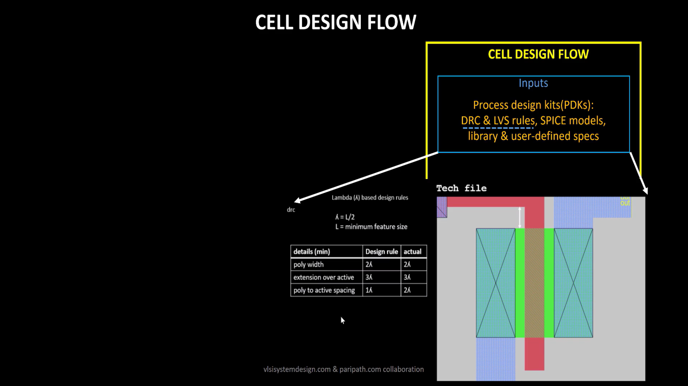
   

 
Typical library parameters for standard Cells.

### Circuit design steps
User-defined Specifications:
1. Cell Height: Tells the drive strength depending on the height.The separation between the power rail and the ground rail defines the cell height. Cell width depends upon the timing and drive strength.It is the responsibility of developer to keep this width maintained for the library.
 
2. Supply Voltage:D epending upon the Noise margin, how much supply voltage is needed that goes in the library development
3. Metal: If there is a restriction that the library is to be built on a metal layer.The library may contain information for a standard cell, for which the  metal line it should be connected to should be metal3,4,5 etc.

4. Pin Locations:The pin location can also be a parameter for which the standard cells would be different in the library.
 

Design involves three steps, which are circuit design, layout design, and characterization. Designing is done based on the PDKs given by the founder,y keeping in mind to stick with the specifications the foundry has given strictly.
In circuit Design, there are two steps.
  1. The first step is to implement the function itself, and the second step is to model the PMOS and NMOS transistors in such a fashion in order to meet the library requirement.
   
  2. The third step is Output. The typical output that we get from the circuit design is a CDL(circuit description language) file, GDSII, LEF, extracted spice netlist(.cir).

  

### Layout design step
In Layout Design First step is to get the function implemented through the MOS transistor through a set of PMOS and NMOS transistors, and the second step is to get the PMOS network graph and the NMOS network graph out of the design that has been implemented.
After getting the network graphs next step is to obtain the Euler's path. Eule's path is the path that is traced only once.
Like for the given example, the Euler path is A-C-E-F-D-B.
 
Then we make a stick diagram of it. For the Stick A and C, Drain and Source are connected for pMOS, and for nMOS, both sources are connected.
  
 Then this layout is taken in the Magic tool
  
 Then we find the parasitic capacitance and do the characterization.
  
  
 The extracted Spice Netlist tells about the parasitic capacitances. Characterization tells about Timing, Noise, and Power information.
### Typical characterization flow
 
The image is for Inverter and the steps will be to characterize the Inverter cell.
 

 
 
 
1. Read the model file 
2. Read the extracted Spice Netlist
3. Recognize the behaviour of buffer
4. Read the sub-circuit of the inverter
5. Attach the necessary power sources.
6. Provide Stimulus input
7. Provide with output Capacitance
8. Give Simulation command as.tran or .dc for Transient or DC analysis.
GUNA is used to get the characterization as all the above inputs will be fed to it in a file format.
 

## General timing characterization parameters

### Timing threshold definitions
As seen in the previous section we have inverter connected back to back, we have power sources, we have the stimulus applied to the inverter all these things brings a very important point of understanding differenet threshold points of a waveform itself and it is called as "Timing threshold definitions'.
In the figure below the term 'Slew_low_rise-thr' depicts the value close to 0. and the typically value of this is about 20% it could be 30% as well. 
<b>Slew_low_rise-thr</b>
 
<b>Slew_high_rise_thr</b>
 
<b>Slew_low_fall_thr</b>
 
<b>Slew_high_fall_thr</b>
 

Now, taking the waveform of the input stimulus, which is the input to the first buffer, and using that to obtain the output of the first buffer. Similar to a slew, thresholds for delay are also available. For that same reason, we have to take some rise and fall points from the waveforms. These thresholds are almost 50%. 
<b>in_rise_thr</b>
 
<b>in_fall_thr</b>
 
<b>out_rise_thr</b>
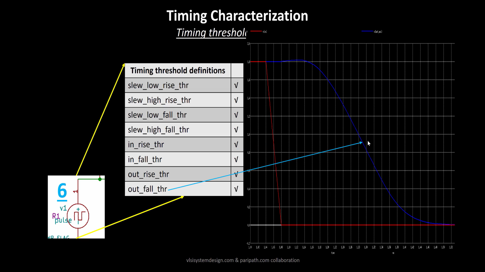 
<b>out_fall_thr</b>
 
### Propagation delay and transition time
Based on these above values we are going to calculate the further values like propogation delay, current,slews etc.
If we want to calculate the delay of anything we need to subtract the out_rise_thr from in_rise_thr. Here let's take typical value 50%, let's see on the particular waveform how does it works Time delay = Time(out_thr)-time(in_thr).

In the above example in_rise_thr and out_fall)thr was kept at 50%. But if the threshold ponit moves to the top the the output comes before the input and we see negative delay and negative delays are not accepted. So the reason behind having this negative delay is poor choice od threshold point so thr choice of the threshold point is really important.

Let's take another example where we have choosed threshold point correctly but still can get a negative delay. Because uotput comes before the input that's why we are getting negative delay here, which is not accepted
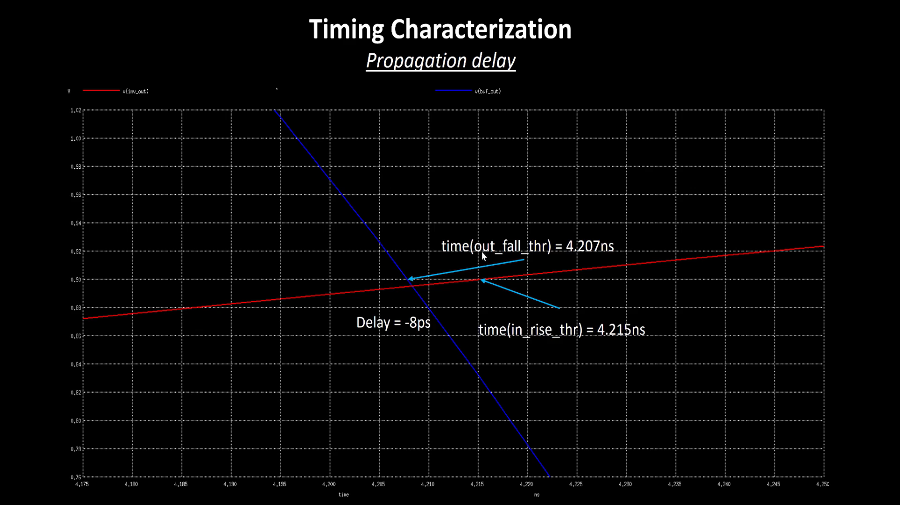

Transition time= time(slew_high_rise_thr)- time(slew_low_rise_thr)
or
transition time = time(slew_high_fall_thr)- time(slew_low_fall_thr)
Let's say we have the waveform to understand the slew calculation.

# Day 3 - Design library cell using Magic Layout and ngspice characterization

## Labs for CMOS inverter ngspice simulations

### IO placer revision
Till now, we have done floor planning and run placement also. But if we want to change the floorplanning, for example, in our floor planning, pins are at equal distance, and if we want to change it, then we can also make it by the Set command.
First, we need to check the switches in the configuration and take the syntax "env(FP_IO_MODE) 1". Then, we need to change it to "env(FP_IO_MODE) 2". After that, we can run the floorplanning again.
Then check the changes in the pins' location through magic -T.

So, here we can see that there are no pins on the upper half side. All pins are in the lower half of the core.
### SPICE deck creation for CMOS inverter
<b>VTC- SPICE simulations:</b>
A SPICE deck has the connectivity information about the netlist. It has inputs that are provided to the simulation, and the deck points that will take the output.
Component connectivity:- In this, we need to define the connectivity of the substrate pin. Substrate pin tunes the threshold voltage of the PMOS and NMOS.

Component values:- Values for the PMOS nad NMOS. We have taken the same size of both PMOS and NMOS.

Identify the nodes:- Node mean the points between which there is a component.These nodes are required to define the netlist.

Name the nodes:- Now we wiil name these nodes as Vin, Vss, Vdd, out.

Now we will start writing the SPICE deck. It's written like shown below
Drain- Gate- Substrate- Source
For M1 MOSFET drain is connected to out node, gate is connected to in node, PMOS transistor substrate and Source is connected to Vdd node.
For M2 MOSFET drain is connected to out node, gate is connected to in node, NMOS source and substrate are connected to 0.

 
  
   

We give dc analysis command and plug the library which has cmos models.

 
  
   

The output graph comes as :

When we change the W/L ratio to 2.5 times for cmos 
the graph gets shifted to right side.

### SPICE simulation lab for CMOS inverter

### Switching Threshold Vm
Switching threshold, Vm (the point at which the device switches the level), is one of the parameters that define the robustness of the Inverter. Switching threshold is a point at which Vin=Vout.
At this point, both transistors are on and in the Saturation region, so there is a lot of leakage current.

### Static and dynamic simulation of CMOS inverter
In Dynamic simulation we will know about the rise and fall delay of CMOS inverter and how does it varying with Vm. In this simulation everything else will remian same except the input which is provided will be a pulse and simulation command will be .tran
The graph Time vs Voltage will be plotted here from where we can calculate the rise and fall delay.

 
  
   

### Lab steps to git clone vsdstdcelldesign
clone the repository https://github.com/nickson-jose/vsdstdcelldesign.git in the openlane directory.

Add the sky130A.tech file in the directory using the command

Open the magic tool with the following command  
<b>magic -T sky130A.tech sky130A_inv.mag & </b>

## Inception of layout ̂A CMOS fabrication process
### Create Active regions

1. Selecting a Substrate: We are taking a p-type Silicon substrate with a 100 orientation.
2. Creating an Active region for transistors.

3. 40-nm of SiO2 is grown on the p substrate thermally, and then Si3N4 is deposited onto it for insulation.
4. 1-micrometer of Photoresist is deposited onto it, and UV light is shined onto it to make the mask soft where light passes and 

Photoresist is etched.
After that Si3N4 is etched.

 
  
   

7. Field Oxide is grown.
  
  
### Formation of N-well and P-well
1. We coat the Substrate with photoresist and put a mask on one side to isolate only one side of the whole substrate. 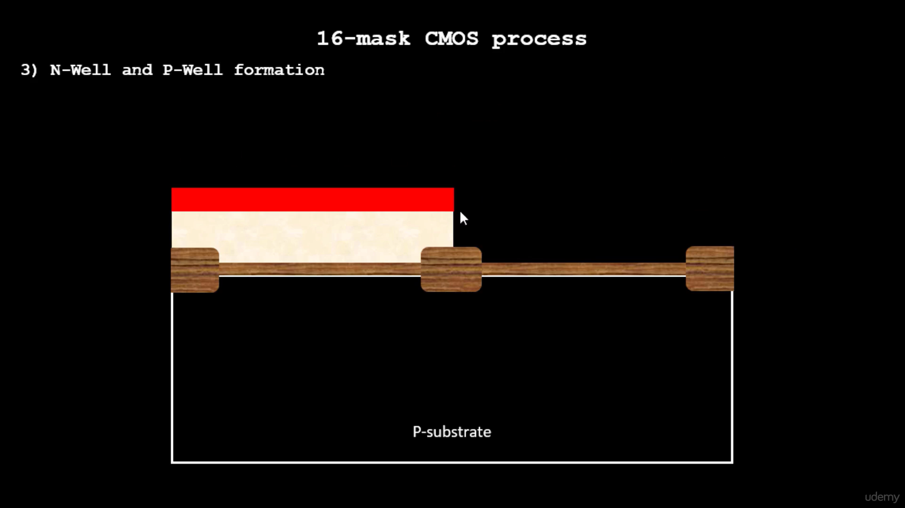
2. Then we etch the photoresist and put Boron at 200keV to make a p-type well.  
3. Repeat the photoresist process and put the mask for the other half.  
4. Add Phosphorus to make an n-type well. 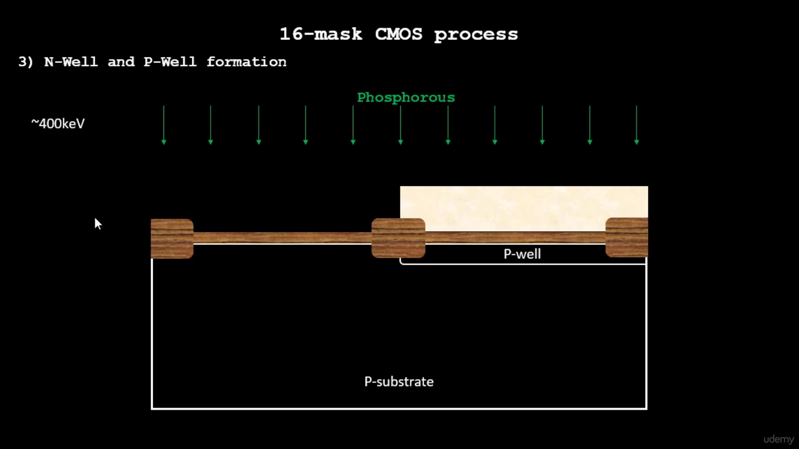
5. To make a deep well, put the Substrate in High high-temperature furnace. 1100C for 4-6hrs. 

### Formation of gate terminal
1. Gate formation:- The Gate terminal is the most important terminal of the PMOS and NMOS because from the gate terminal only we can control the threshold voltage. Doping concentration and oxide capacitance will control the threshold voltage.
2. We are maintaining the doping concentration here. For that, we use mask 4 and again do the ion implantation of boron ions at lower energy (~60kev).
3. Same as we do with Arsenic to make a lightly doped surface for an n-well.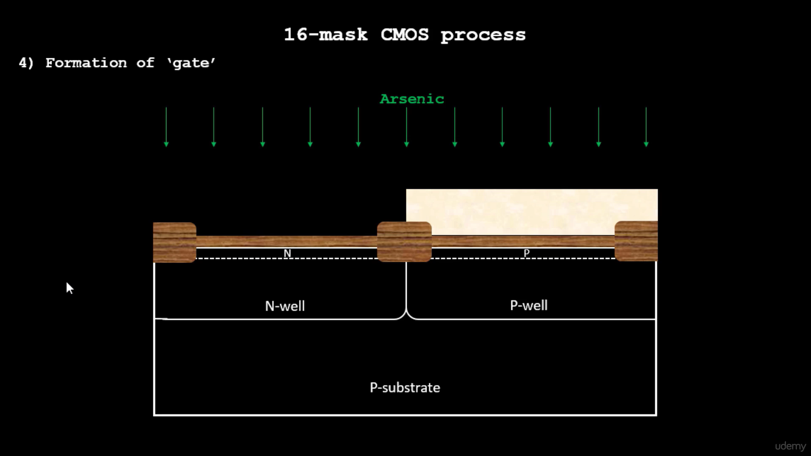
4. We deposit a 0.4-micrometer-thick polysilicon layer.
5. This is how it looks for Mask 6 in Layout 
6. We end up getting this after removing the photoresist. 

### Lightly doped drain (LDD) formation

LDD formation:- Here, we actually want P+, P- ,N doping profile in the PMOS and N+ ,N- ,P doping profile for NMOS. The reason for that is
<b>Hot electron effect</b>
<b>Short channel effect</b>
For the formation of LDD, we again do ion implantation in the P-well by using mask 7, and here we use phosphorus as an ion for light doping.

Same process we will repeat for N-well. There we use mask 8 and Boron Ion.

Now, by creating the spacers, we can protect the actual structure remains constant for P-implant and N-implant. For that we deposit a thick SiO2 or Si3N4 layer over the gate terminal.
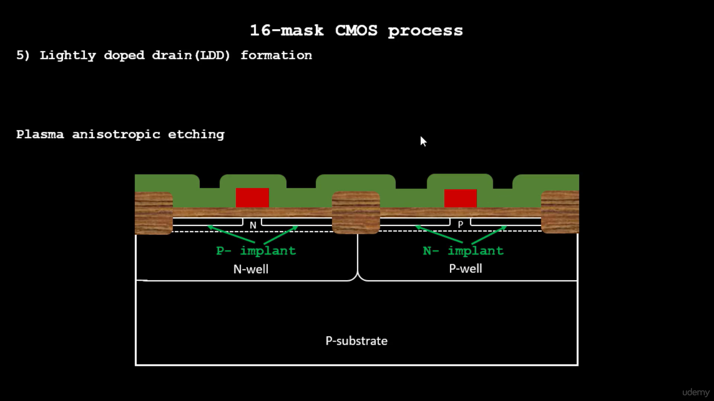
Now, we do Plasma anisotropic etching. By that side-wall spacers are formed.

### Source-drain formation
Next step is deposite the very thin screen oxide layer to avoid the effect of channeling.

Now to form the drain and source, again we do the ion implantation of arsenic at 75kev to create the N+ implant by using mask 9 in the P-well to form PMOS.

 
  
   

Same process we will repeat for NMOS by using the mask 10 and boron ion in the N-well at 50kev to creat P- implant.

Now we put this Half made CMOS into the high temparature (1000 degree)anneling. So P+ implant and N+ implant now become the source and drain.
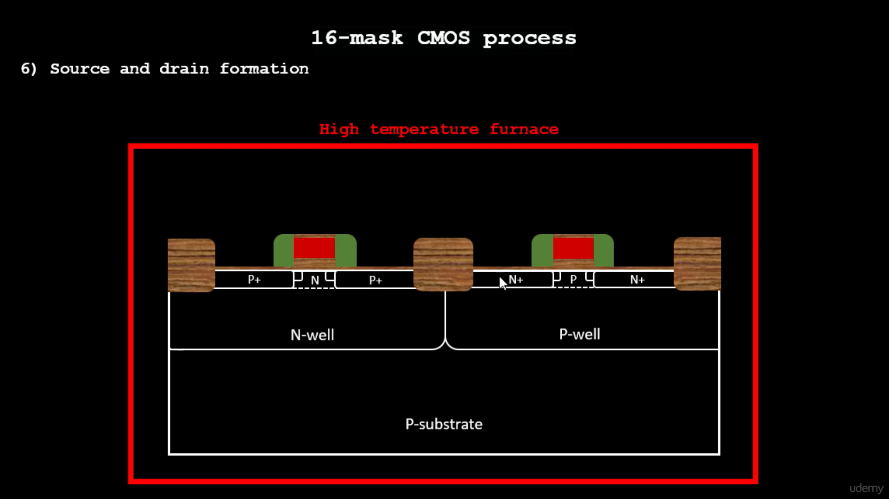

### Local interconnect formation
First step is remove the thin screen oxide layer by etching. Then deposite the titanium (Ti) using sputtering. here Ti is used because Ti has very low resistivity.

 
  
   

Next step is to create the reaction between Ti layer and source, gate, drain of CMOS. For that wafer is heated at about 650-700 degree temparature in N2 ambient for about 60 seconds. and after reaction, we can see the titanium siliside over the wafer. One more reaction is heppend there between Ti and N. and it results the TIN which is used for local communication.

 
  
   

Now by using mask 11 and photoresist, we will etched out the TIN and make perticular contacts. TIN is etched out by using RCA cleaning.

Now, local interconnects are formed after etching and removing the photoresist.

 

 

### Higher-level metal formation
Higher level metal formation:- These steps are very similar like the previous steps. The first thing we are noticing is that the surface is non-planar. It is not advisable to use this type of non-planner surface for metal interconnects due to the problems associated with metal discontinuity. so, we have to planarize the surface by depositing a thick layer of SiO2 with some impurity to make a less resistive layer. And then we used the CMP (chemical mechanical polishing) technique to planarize the surface.

 

 

Now using mask 12 and photoresist, we etched the SiO2 layer to deposit the metal in it.

 

We deposit a tungsten layer like a blanket on it, followed by CMP.

 

After that, Aluminium is deposited as the first Layer of metal contact.

Then we use Mask 14 for more depositions.

Then we deposit SiO2 followed by CMP to prepare it for Si3N4 deposition.

 

Finally we get the desired CMOS.

### Lab introduction to Sky130 basic layers layout and LEF using inverter
In sky130, every color shows a different layer. Here the first layer is for local interconnect, shown by blue_purple color, thenthe  second layer is metal 1 which is shown by light purple color, and the metal 2 is shown by pink color. N-well is shown by solid dash line. Green is the N-diffusion region, and red is for polysilicon gate. similarly the brown color is for P-diffusion.
In tckon window, we can see that the selected area is NMOS and similarly we can chech PMOS also. and that is how we can check that the CMOS is working or not.

If we double-press Y, we can see that it selects the entire thing that it connects to.

 

### Lab steps to create std cell layout and extract spice netlist
To extract the file from here, we have to write the command in tckon window. and the command is <b>extract all</b>

Write the command in tkcon window.

Write the command.

 

## Sky130 Tech File Labs
### Lab steps to create final SPICE deck using Sky130 tech

Here, we can see all the details about the connectivity of the NMOS and PMOS and about the power supply also.
X0 is NMOS and X1 is PMOS and both's connectivity is shown as GATE DRAIN SUBSTATE SOURCE.
We will change the width to 0.01 as it's the box value in Layout.
Change X0 to M1000 and X1 to M1001

Change the file same as the above

Write the command same as the above to run ngspice

### Lab steps to characterize inverter using sky130 model files

Changing the values in the .spice to these values.

Use the command <b>ngspice sky130_inv.spice</b>
And use the command <b> plot y vs time a </b>

Calculate the rise and fall time 
1. Rise time: It is the time taken for the output waveform to 20% value to 80% value.
  2.20364-2.1614 = 42.24ps

 

 
2. Fall time: It is the time taken by the output to transition from 80% to 20%.
  4.06819-4.04041 = 27.78ps

3. propagation delay: It is the time difference between 50% of the input and 50% of the output.
2.18453-2.15 = 34.53ps
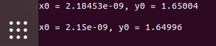
4. Cell fall delay: It is the  time for the output falling to 50% and the input rising to 50%.
4.05432-4.04997 = 4.35ps

### Lab introduction to Magic tool options and DRC rules

To know more about the Magic DRC we can go to the website:- http://opencircuitdesign.com/magic/Technologyfiles/TheMagicTechnologyFileManual/DrcSection
Link to Google_Skywaters Design Rules: - https://skywater-pdk.readthedocs.io/en/main/rules/periphery.html
For reference , we can use the github repo of Google-Skywater: - https://github.com/google/skywater-pdk

### Lab introduction to Sky130 pdk's and steps to download labs
Go to the home directory.
To download the lab files for performing DRC corrections:

wget http://opencircuitdesign.com/open_pdks/archive/drc_tests.tgz
To extract the lab files from the downloaded file:
tar xfz drc_tests.tgz
Then go inside the lab folder drc_tests.
To list all the directories, we can use the command ls -al.
To view the .magicrc file, we can use the command gvim .magicrc. This file serves as the startup script for magic and tells it where to find the technology file. The technology file is already available locally in the same directory, so we can make changes to it if needed.
To start the magic tool with better graphics, we can use the command magic -d XR &.

### Lab introduction to Magic and steps to load Sky130 tech-rules
Use the command <b>magic -d XR</b>
To open the magic tool. Select the met3.mag file from the file menu.

type drc why in the tkcon menu 

Type cif see VIA2
black boxes will come on the design we just created.

### Lab exercise to fix poly.9 error in Sky130 tech-file
Now, we will open the poly.mag file in the magic tool with the help of the command load poly.mag in the tkcon terminal.

We will add the missing line of code in sky130.tech file in the drc directory.

After changing the code,type check drc in the tkcon window.

### Lab exercise to implement poly resistor spacing to diff and tap

Changed the file by adding the highlighted command

Made the structure.
### Lab challenge exercise to describe DRC error as geometrical construct

Changed the file again.

Made the structure.

### Lab challenge to find missing or incorrect rules and fix them
Now we will open the magic tool and execute the commands drc style drc(full) and drc check.

# Day 4 - Pre-layout timing analysis and importance of good clock tree
## Timing modeling using delay tables

### Lab steps to convert grid info to track info
Now, we need to generate the .lef file from the corresponding .mag file so it can be integrated into the picorv32a flow.
Important Guidelines:
1. Input and output ports should be placed at the intersections of vertical and horizontal routing tracks.
2. The width of the standard cell must be an odd multiple of the horizontal track pitch, and the height must be an odd multiple of the vertical track pitch.
Check the track.info file from the Source
<b>pdk/sky130/libs.tech/openlane/sky130_fd_sc_hd/track.info</b> 

From the track file we will add the x,y,origin x,y and put it in the grid command to increase the grid size in the layout.

Now we can see that, the ports has been placed at the intersection of the tracks. But between the boundaries, 3 boxes are covered. so our second requirment also satisfies here.

### Lab steps to convert magic layout to std cell LEF

Go to Edit and select Text menu and then fill the box accordingly as in the image.
After this, we will create a .lef file.

Save it as in the menu box.

Now, we open this file in the magic by the command
<b>magic -T sky130A.tech sky130_vsdinv.mag &</b>

### Introduction to timing libs and steps to include new cell in synthesis
1. Copy the file in the directory like in the Image.
  
  
  This is the file that we just created.
  
2. Change the config.tcl file in the picorv32a folder to this.
  

    
    
  

  
3. Copy these files in the designated folder as in the Image.
4. <b>Use the command prep -design picorv32a -tag 24-06_17-52 -overwrite </b>

5. Use command Run_floorplan and run_synthesis 

### Introduction to delay tables
Power Aware CTS:- We can Gate the Clock with this,If we pass input 1 and Clock in AND gate then it will only pass when both are 1.Similarly if we use input 0 and Clock for OR gate then it will not pass if clock is zero.So the advantage of this blocking period is that we can save lot of power in clock tree.
 
  
  We have made some assumptions that for each buffer the input output Capacitance is same but it is not.

So because of this variation in output and input we will have varity of delays.To calculate this we will use Delay tables.

### Delay table usage Part 1
For practical example let's say we have the input transition of 40ps of buffer1 the output capacitance of this particular buffer is 60ff. The delay of the cell in this case is lies between x9-x10.
So the values which are not available in the delay table those are extrapolated from the given data so we can take the range in that case.
 
 
### Delay table usage Part 2
Now we have to calculate the delay of buffer 2 and after that we can find the latency at the 4 clock end points.
Here input transition is common for both the buffers. now assuming that the transition is around the 60psec and load at both the buffers is 50fF. so it will give the delay of y15.
The total delay from input to the output is= x9' + y15.(Here we are ignoring the delay of the wires). that means the skew at the any output point is zero.
If load is not same at the every nodes, the skew will not be the zero.
So if the load of the lower buffer was y17 then the delay would be x9'+y17.
 
### Lab steps to configure synthesis settings to fix slack and include vsdinv
We will add our sky130_vsdinv file in the picorv32a design.
Write the commands in the following order
1. echo $::env(SYNTH_STRATEGY)
2. set ::env(SYNTH_STRATEGY) "DELAY 3"
3. echo $::env(SYNTH_BUFFERING)
4. echo $::env(SYNTH_SIZING)
5. set ::env(SYNTH_SIZING) 1
6. echo $::env(SYNTH_DRIVING_CELL)
7. run_synthesis 

      
      
      
    

8. It will cause error for floorplan so write these commands.
9. init_floorplan
10. place_io
11. tap_decap_or  
12. Use the above command to open the magic window

type expand in the Tkcon menu

## Timing analysis with ideal clocks using openSTA

### Setup timing analysis and introduction to flip-flop setup time
Let's start the setup analysis with the ideal clock(single clock). specifications of the clock is
clock frequency =1 GHz
clock period =1 ns
The combinational delay is θ and the time period is T.For signal to reach correctly the delay should be less than T.Inside the D flop there are MUX and it takes time for the input to settle down which is kmown as SET-UP time.Hence finite time 's' required before clk edge for 'D' to reach Qm.
So, now θ<T becomes θ<(T-S) where s is set-up time.
 

### Introduction to clock jitter and uncertainty
Since the PLL generates the Clock Signal so there can be uncertainity as to when the pulse can come this window of time is called clock jitter.
  
And hence we add another time window valled Setup uncertainity SU.
For the above image the delay is calculated based on CLOCK-Q delay and the estimate wire delay to reach from Launch Flop to Capture Flop.

### Lab steps to configure OpenSTA for post-synth timing analysis
Make these files.
1. pre_sta.config 
2. my_base.sdc File 
3. Use command sta pre_sta.config in openlane directory 
### Lab steps to optimize synthesis to reduce setup violations
in the Openlane Flow use the command
1. set ::env(SYNTH_MAX_FANOUT) 4
2. run_synthesis 
### Lab steps to do basic timing ECO
To reduce the slack we will replace the gate which has driving strenth of 2 but driving 4
Using the command replace_cell _14514_ sky130_fd_sc_hd__or3_4 

 The slack got reduces

## Clock tree synthesis TritonCTS and signal integrity

### Clock tree routing and buffering using H-Tree algorithm
If we connect all the blocks without any rules there would be skew or time lag in reaching all the blocks at same time.
So we use H-tree algorithm where we traverse half distance between two blocks and then give buffer and connect it to the blocks.
 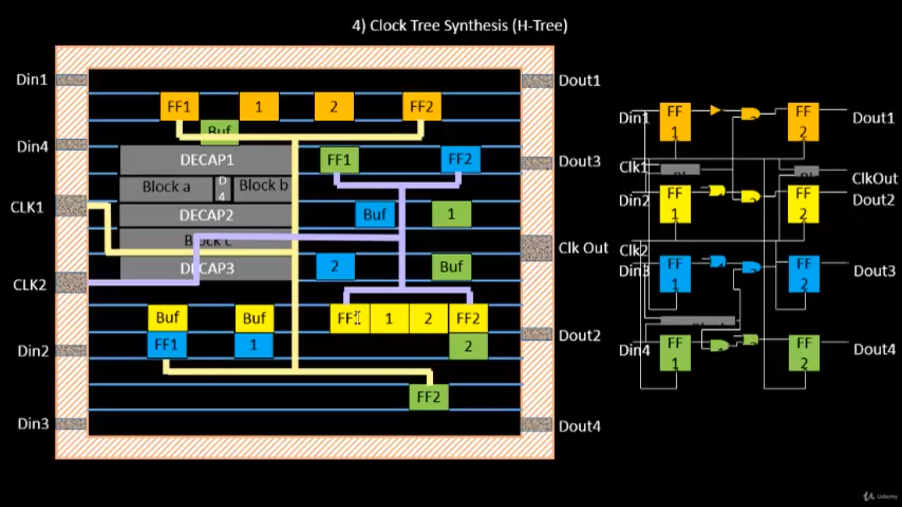
Since the physical length of wire is significant we need to add buffers in the correct places.

### Crosstalk and clock net shielding
Since the clock signal is critical path if there is some cross-talk between clock signal and some other block transitioning from zero to one it can cause huge delay or can corrupt the whole memory for some critical chip in automobile.To tackle this issue the clock paths are shielded so it does not create any problem for the clock path.

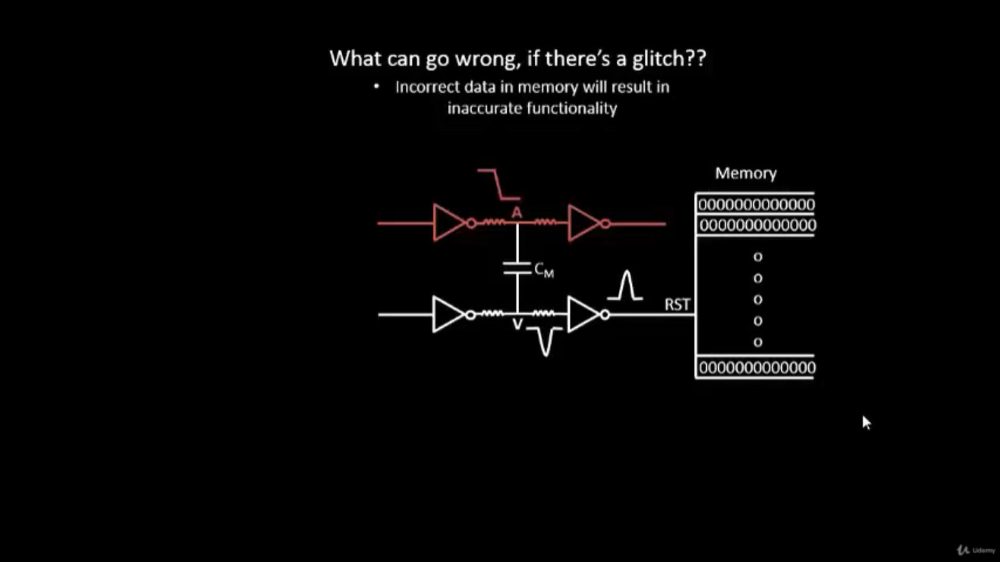

### Lab steps to run CTS using TritonCTS
First we need to replace the old synthesis file after we have improved the slack.

We will use this file to run synthesis now.
1. init_floorplan
2. place_io
3. tap_decap_or
4. run_placement
5. run_cts
6. This will create a cts file in the synthesis folder.

### Lab steps to verify CTS runs
OPENROAD To create a database in OPENROAD using LEF and TMP files, we can use the following commands:
First, make sure we are in the directory where the LEF and TMP files are located.
Then, enter the following command to start the OPENROAD tool,
openroad
Once you are in the OPENROAD tool, enter the following command to create the database,
For Reading lef file
read_lef /openLANE_flow/designs/picorv32a/runs/24-06_17-52/tmp/merged.lef
For Reading def file
read_def /openLANE_flow/designs/picorv32a/runs/24-06_17-52/results/cts/picorv32a.cts.def
To Create an OpenROAD database file named pico_cts.db
write_db pico_cts.db
Now we can see this database file is present in openlane directory.

## Timing analysis with real clock using openSTA

### Setup timing analysis using real clocks
With real clocks we have buffers and the delay comes from the PLL to the launch flop aswell.

So for Setup analysis,we need to consider the time in the below way,

"1+2"=∆1 and "1+3+4"=∆2 and (∆1-∆2)=skew 
As for Hold analysis it is opposite of Setup time,the arrival time should be more than Hold time.
Hold timing analysis:- Here we are sending the first pulse to both the launch FLop and capture flop.
Hold condition state that Hold time (H)< combinational delay (θ). So, (θ>H).
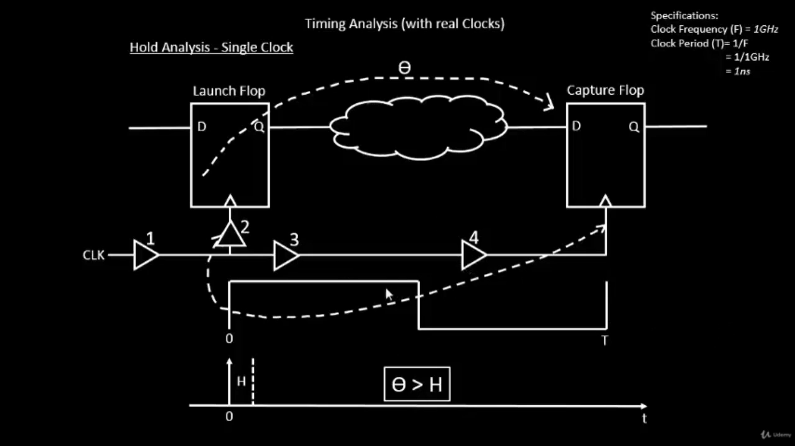 

### Hold timing analysis using real clocks

Le us consider the following clock path.
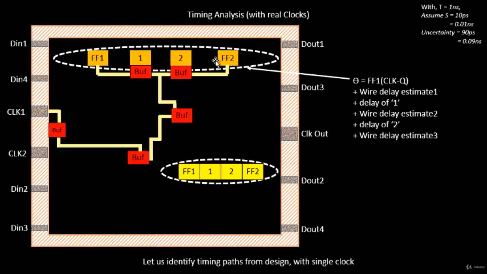

Then we will be considering the delay due to physcial wire and delay due to the buffer so ∆1 and ∆2 tells us that.
### Lab steps to analyze timing with real clocks using OpenSTA
We will use openroad to use the following command to run the rest of the OpenFlow
1. To load the created db file in Openroad <b>read_db pico_cts.db</b> 
2. To read the netlist post CTS <b> read_verilog /openLANE_flow/designs/picorv32a/runs/02-04_05-27/results/synthesis/picorv32a.synthesis_cts.v </b>
3. To read the library for design <b>read_liberty $::env(LIB_SYNTH_COMPLETE)</b>
4. To link the design and library <b>link_design picorv32a</b>
5. To read the custom sdc we have created <b>read_sdc /openLANE_flow/designs/picorv32a/src/my_base.sdc</b>
6. To setting all clocks as propagated clocks <b>set_propagated_clock [all_clocks]</b>
7. To Generate the custom timing report <b>report_checks -path_delay min_max -fields {slew trans net cap input_pins} -format full_clock_expanded -digits 4</b>
8. To exit from Openlane flow <b>exit</b>

### Lab steps to execute OpenSTA with right timing libraries and CTS assignment

<b>To remove sky130_fd_sc_hd__clkbuf_1 from the list </b>

set ::env(CTS_CLK_BUFFER_LIST) [lreplace $::env(CTS_CLK_BUFFER_LIST) 0 0]

<b>To check the current value of CTS_CLK_BUFFER_LIST</b>

echo $::env(CTS_CLK_BUFFER_LIST)

<b>To check the current value of CURRENT_DEF</b>

echo $::env(CURRENT_DEF)

<b>To set def as placement def</b>

set ::env(CURRENT_DEF) /openLANE_flow/designs/picorv32a/runs/02-04_05-27/results/placement/picorv32a.placement.def

<b>To run cts</b>

run_cts

<b>To check the current value of CTS_CLK_BUFFER_LIST</b>

echo $::env(CTS_CLK_BUFFER_LIST)

### Lab steps to observe impact of bigger CTS buffers on setup and hold timing
    
Now we will follow the same commands we have used earlier to run OPENROAD,

1. openroad
2. read_lef /openLANE_flow/designs/picorv32a/runs/24-06_17-52/tmp/merged.lef
3. read_def /openLANE_flow/designs/picorv32a/runs/24-06_17-52/results/cts/picorv32a.cts.def
4. write_db pico_cts1.db
5. read_db pico_cts.db
6. read_verilog /openLANE_flow/designs/picorv32a/runs/24-06_17-52/results/synthesis/picorv32a.synthesis_cts.v
7. read_liberty $::env(LIB_SYNTH_COMPLETE)
8. link_design picorv32a
9. read_sdc /openLANE_flow/designs/picorv32a/src/my_base.sdc
10. set_propagated_clock [all_clocks]
11. report_checks -path_delay min_max -fields {slew trans net cap input_pins} -format full_clock_expanded -digits 4
12. report_clock_skew -hold
13. report_clock_skew -setup
14. exit

 
# Day 5 -Final step for RTL2GDS using tritinRoute and openSTA

## Routing and design rule check (DRC)

### Introduction to Maze Routing-Lee’s algorithm

For this Layout, we will be doing Routing and DRC analysis.
Routing:- It is finding the shortest possible connection between two end points. We want as less number of turns as possible.

So between point 1 and point 2 we will be finding the best possible way to connect these points.
In Lee's Algorithm, the whole Layout is divided into small grids, and numbers are given from the Source to the Target.

### Lee’s Algorithm conclusion

  For Source initially number 1 is given and the number increases for its horizontal and vertical neighbours but not diagonally.

  
   

Since the latter one has fewer turn, it is preferred over the first one.
Similarly, we will consider different Flops this time.

  
   
  So the first one would be considered as less bending of wires.

### Design Rule Check
DRC stands for Design  Rule Check, and these are certain rules that need to be kept in mind when doing Physical Design, as these rules tell whether the design can be fabricated in foundry or not.

  
   
  So the first one would be considered as less bending of wires.

We will look at these close wires.
1. Wire Width: Due to the limit of Photolithography, we can't make certain patterns below certain width. 
2. Wire Pitch: Smaller pitch allows for higher routing density, which is crucial in advanced nodes, whereas Larger pitch improves signal integrity and reduces crosstalk, but consumes more area.  
3. Wire Spacing: Minimum spacing is required; otherwise, it will be shorted in the fabrication process.  
Let us take a look at another kind of DRC Violation.
 
 In this, we see the metal lines are getting shorted.
 So we use two different metal lines where the top one is thicker as it offers less resistance.
 
  Need to check for Via Width :
  Need to check for Via Spacing:

### Parasitic Extraction
Since all the metal lines are having parasitic resistances and capacitances it is extracted to get better timining.
 

## Power Distribution Network and routing

### Lab steps to build power distribution network

1. <b>docker</b>
2. <b>./flow.tcl -interactive</b>
3. <b>package require openlane 0.9</b>
4. <b>prep -design picorv32a -tag 24-06_17-52 </b> [Does not Overwrite]
5. <b>echo $::env(CURRENT_DEF)</b>  [Tells at what stage we are in the Flow]

So, till here we have done CTS and now we are going to do the routing. but before routing we have to generate the PDN(power distribution network)file by using the command.

gen_pdn

### Lab steps from power straps to std cell power
 
The red lines are Power Lines and the blue ones are ground Lines. The bordering and corner yellow pads are I/O pads from where we are getting the Power and Ground Supplies, and the green region consists of the Standard Cells.
We have vertical and horizontal tracks, which ensure that the power is being transferred from the ring to the chip. This is shown by the red and blue colors. This is how power planning works in the physical design of any device.

### Basics of global and detail routing and configure TritonRoute
Now we will be doing Routing.
Use the command run_routing in the OpenLane flow.

1. For Global Routing: FastRoute is used.
2. For Detailed Routing: TritonRoute is used.

## TritonRoute Features

### TritonRoute feature 1 - Honors pre-processed route guides
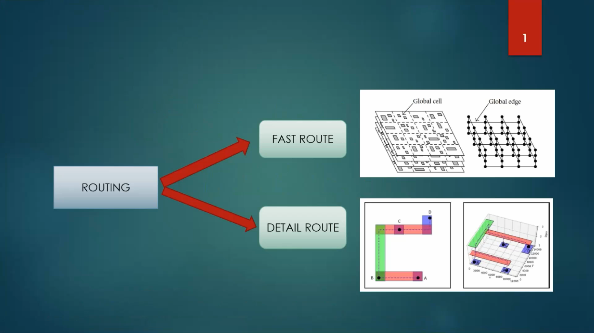
In the Global route, the routing region is devided into the rectangular grids cells as shown in the figure above. And it is represented as cores 3D routing graph. Global route is done by FAST route engine.The detailed route is done by TritonRoute engine. A,B,C,D are four pins which we want to connect through routing. and this whole image of A,B,C,D shows the net.
<b>Features of TritonRoute</b>

Metal 1 Line has direction preference in the Vertical Direction and Metal 2 Line has direction preference in the Horizontal Direction.
1. Splitting happens in the preferred Direction so in the Image(b) we can see the splitting of horizontal metal lines.
2. In the image(c),merging happens of these unit width wire with the preference Direction line.
3. The guides shown in blue (M1) and red (M2) initially have gaps between them after splitting and merging.
<ul>
Bridging ensures that these pieces are connected logically and geometrically, often by:
<li>Creating vertical connections (vias) between metal layers (e.g., M1 ↔ M2)</li>
<li>Adding small guide boxes between segments to form a continuous path</li>
<li>It resolves potential routing discontinuities so that the detailed router doesn't misinterpret the layout as unconnected.</li>
</ul>

### TritonRoute Feature2 & 3 - Inter-guide connectivity and intra- & inter-layer routing

### TritonRoute method to handle connectivity
INPUTS:-LEF
OUTPUTS:-detailed routing solution with optimized wire-length and via count
CONSTRAINTS:-Route guide honouring, connectivity constraints, and design rules.

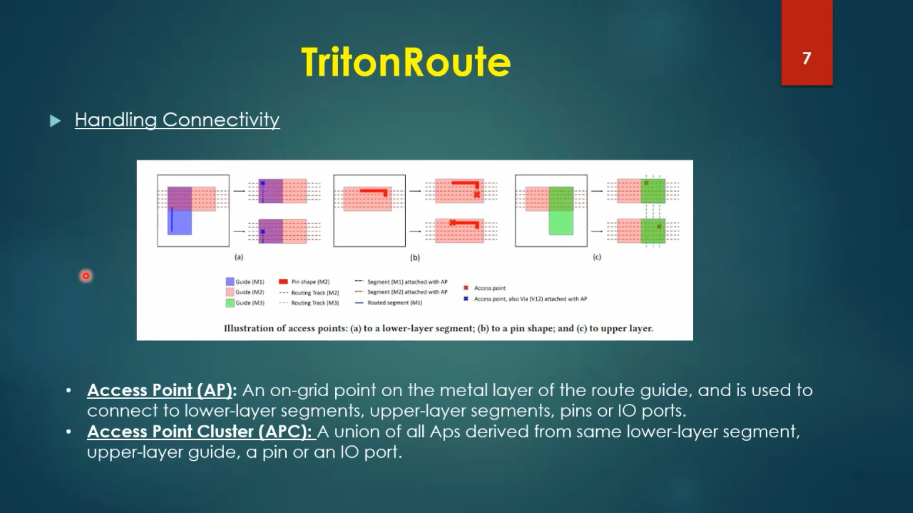
### Routing topology algorithm and final files list post-route  

The routing is done with zero Violation.

We will go to SPEF_EXTRACTOR located in the directory.

1. Take the LEF file
2. Take the DEF file
3. Plug it in the code
We get the .spef File

Run the Following Command to open the final generated Layout.

Final Layout.

## References
1. https://github.com/efabless/OpenLane/blob/master/README.md 
2. https://github.com/google/skywater-pdk
3. https://github.com/nickson-jose/vsdstdcelldesign

## Acknowledgement
I express my gratitude to Mr. Kunal Ghosh, Co-founder of VLSI System Design (VSD) Corp. Pvt. Ltd., Mohamed Shalan from efabless.com, and Mr. Nickson Jose for their guidance and for this workshop named the DIGITAL-VLSI-SOC-DESIGN-AND-PLANNING. The workshop was excellent, and I got to know a lot about the whole RTL to GDSII flow and how it can be implemented using various open-source tools that are embedded in the flow, OpenLANE.

