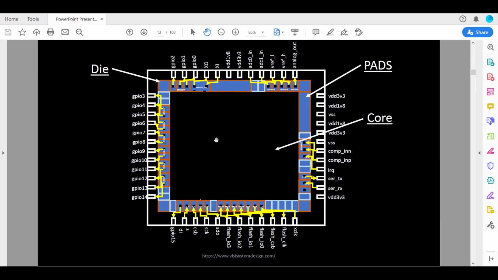
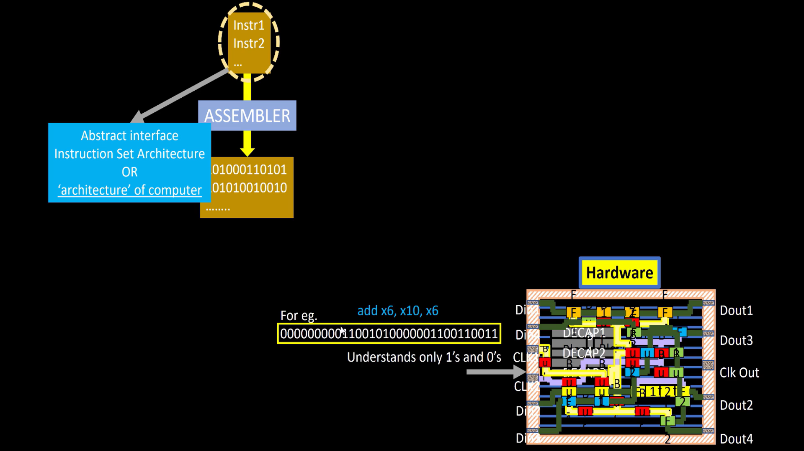
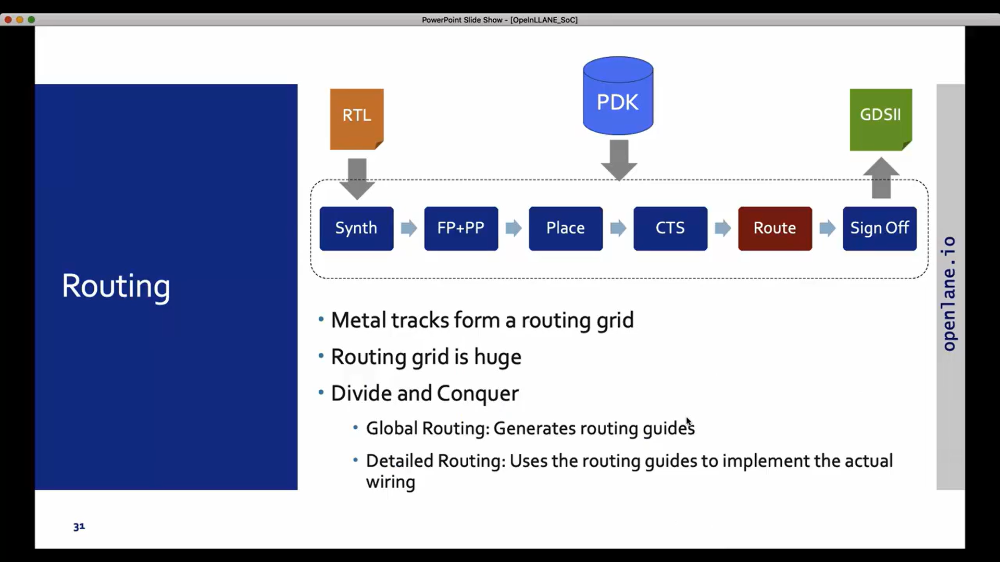
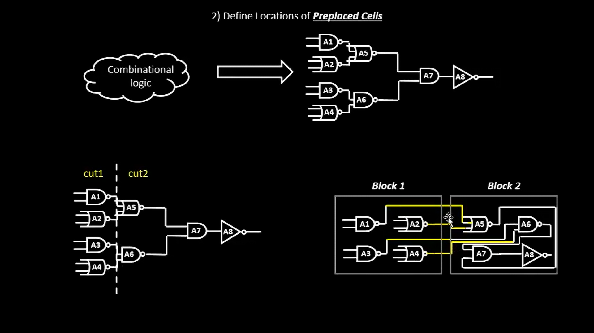

Notes Summarized for the Workshop held between 18th June and 1st July 2025
## Day 1 - Inception of open-source EDA, OpenLANE and sky130 PDK
### How to talk to computers
1. Introduction to QFN-48 Package, chip, pads, core, die and IPs
2. Introduction to RISC-V
3. From Software Applications to Hardware
### Soc design and OpenLANE
1. Introduction to all components of open-source digital asic design
2. Simplified RTL2GDS flow
3. Introduction to OpenLANE and Strive chipsets
4. Introduction to OpenLANE detailed ASIC design flow
### Get familiar to open-source EDA tools
1. OpenLANE Directory structure in detail
2. Design Preparation Step
3. Review files after design prep and run synthesis
4. OpenLANE Project Git Link Description
5. Steps to characterize synthesis results
## Day 2 - Good floor planning considerations
### Chip Floor planning consideration
1. Utilization factor and aspect ratio
2. Concept of pre-placed cells
3. De-coupling capacitors
4. Power planning
5. Pin placement and logical cell placement blockage
6. Steps to run floorplan using OpenLANE
7. Review floorplan files and steps to view floorplan/a>
8. Review floorplan layout in Magic
### Library building and Placement
1. Netlist binding and initial place design
2. Optimize placement using estimated wire-length and capacitance
3. Final placement optimization
4. Need for libraries and characterization
5. Congestion aware placement using RePlAce
### Cell design and characterization flows
1. Inputs for cell design flow
2. Circuit design steps
3. Layout design step
4. Typical characterization flow
### General timing characterization parameters
1. Timing threshold definitions
2. Propagation delay and transition time
## Day 3 - Design library cell using Magic Layout and ngspice characterization
### Labs for CMOS inverter ngspice simulations
1. IO placer revision
2. SPICE deck creation for CMOS inverter
3. SPICE simulation lab for CMOS inverter
4. Switching Threshold Vm
5. Static and dynamic simulation of CMOS inverter
6. Lab steps to git clone vsdstdcelldesign
### Inception of layout ̂A CMOS fabrication process
1. Create Active regions
2. Formation of N-well and P-well
3. Formation of gate terminal
4. Lightly doped drain (LDD) formation
5. Source-drain formation
6. Local interconnect formation
7. Higher level metal formation
8. Lab introduction to Sky130 basic layers layout and LEF using inverter
9. Lab steps to create std cell layout and extract spice netlist
### Sky130 Tech File Labs
1. Lab steps to create final SPICE deck using Sky130 tech
2. Lab steps to characterize inverter using sky130 model files
3. Lab introduction to Magic tool options and DRC rules
4. Lab introduction to Sky130 pdk's and steps to download labs
5. Lab introduction to Magic and steps to load Sky130 tech-rules
6. Lab exercise to fix poly.9 error in Sky130 tech-file
7. Lab exercise to implement poly resistor spacing to diff and tap
8. Lab challenge exercise to describe DRC error as geometrical construct
9. Lab challenge to find missing or incorrect rules and fix them
## Day 4 - Pre-layout timing analysis and importance of good clock tree
### Timing modeling using delay tables
1. Lab steps to convert grid info to track info
2. Lab steps to convert magic layout to std cell LEF
3. Introduction to timing libs and steps to include new cell in synthesis
4. Introduction to delay tables
5. Delay table usage Part 1
6. Delay table usage Part 2
7. Lab steps to configure synthesis settings to fix slack and include vsdinv
### Timing analysis with ideal clocks using openSTA
1. Setup timing analysis and introduction to flip-flop setup time
2. Introduction to clock jitter and uncertainty
3. Lab steps to configure OpenSTA for post-synth timing analysis
4. Lab steps to optimize synthesis to reduce setup violations
5. Lab steps to do basic timing ECO
### Clock tree synthesis TritonCTS and signal integrity
1. Clock tree routing and buffering using H-Tree algorithm
2. Crosstalk and clock net shielding
3. Lab steps to run CTS using TritonCTS
4. Lab steps to verify CTS runs
### Timing analysis with real clock using openSTA
1. Setup timing analysis using real clocks
2. Hold timing analysis using real clocks
3. Lab steps to analyze timing with real clocks using OpenSTA
4. Lab steps to execute OpenSTA with right timing libraries and CTS assignment
5. Lab steps to observe impact of bigger CTS buffers on setup and hold timing
## Day 5 -Final step for RTL2GDS using tritinRoute and openSTA
### Routing and design rule check (DRC)
1. Introduction to Maze Routing-Lee’s algorithm
2. Lee’s Algorithm conclusion
3. Design Rule Check
### Power Distribution Network and routing
1. Lab steps to build power distribution network
2. Lab steps from power straps to std cell power
3. Basics of global and detail routing and configure TritonRoute
### TritonRoute Features
1. TritonRoute feature 1 - Honors pre-processed route guides
2. TritonRoute Feature2 & 3 - Inter-guide connectivity and intra- & inter-layer routing
3. TritonRoute method to handle connectivity
4. Routing topology algorithm and final files list post-route
## References
## Acknowledgement

# Day 1 - Inception of open-source EDA, OpenLANE and sky130 PDK
## How to talk to computers
### Introduction to QFN-48 Package, chip, pads, core, die and IPs

  

  This is an Arduino Uno board, which is a microcontroller as it features a microprocessor, memory, and other Ports for input and output. The chip encircled by a yellow circle is called a processor.
  The design of this chip from the abstract level down to the fabrication is done by RTL to GDSll flow.
    

  

 
The above image shows different components of the microcontroller board having different SDRAM memories, JTAG, and UART protocols along with SoC/Processor.
  

  

The above image shows different I/O ports associated with the QFN package.
  

  

The above image shows that different I/O ports associated with the QFN package are wire bonded to the Chip.
  

  

Chip components:
<ul>
  <li>Pads: Through which we can send the signal inside the chip, I/O ports are made here. </li>
  <li> Core: Place where all the logic blocks are placed. </li>
   <li> Die: the chip is placed in this physical area, which is utilized based on the requirements. </li>
</ul>
  
 

  

The aboce image shows different parts that makes a working chip which consists of PLL,ADC,DAC RISC-V SoC,SRAM which can be classified in :
<ul>
  <li><b> Macros:</b> Predefined functional Blocks that can be used for creating certain logic.For example :RISC-V Soc Architecture, SPI </li>
   <li><b>IPs:</b> Intellectual Property, which is outsourced from vendors and is fully optimized to be used in the Chip, as it is not necessary to make these designs again and again.For example, SDRAM,PLL,ADC,DAC</li>
</ul>

### Introduction to RISC-V
RISC-V ISA (Instruction Set Architecture)
This stands for Reduced Instruction Set Computer V, where V means the generation.
It is an open-source, free-to-use architecture type that supports 32, 64, and 128-bit architectures.

  

The above image shows the C code and how it is implemented in the Picorv32 processor and the physical Layout of the Chip

### From Software Applications to Hardware
Application Software runs on Hardware, they communicate with each other via System software (Operating System), which converts the High-level language Code to low-level Language code and then into assembly, which is then converted into binary digits that the Computer understands.

  

So for a Simple code of a watch written in the C language, the compiler compiles the code and makes it in assembly language, which is then given to an assembler to be decoded into binary Language. 

In the image, we can see the RISC-V instruction set that will be implemented on the hardware, given is the physical Layout of the same.

All the code is to be written in this Course.

These Instructions act as an <b>abstract interface</b> between the C language and Hardware.
 

There is another Interface between Instruction Set and Hardware that is needed, and it is called Hardware Descriptive Language, as Hardware only understands 1s and 0s. 
RTL Language implements the instructions, and it is called RTL Implementation of Instruction Set.

## Soc design and OpenLANE
### 1. Introduction to all components of open-source digital ASIC design

Digital ASIC Design Flow is made of three components:
<ul>
<li>RTL IP's</li>
<li>EDA tools</li>
<li>PDK's</li>
</ul>
For making an open-source ASIC Design, all these are required.

### RTL IPs
RTL IPs—short for Register Transfer Level Intellectual Properties—are reusable hardware design blocks described at the RTL abstraction level, typically using languages like Verilog or VHDL. These IPs are foundational in building complex digital systems like SoCs (System on Chips) and FPGAs.

### EDA Tools
Electronic Design Automation (EDA) tools are the digital backbone of modern chip and circuit design. They’re sophisticated software suites that help engineers design, simulate, verify, and prepare electronic systems—like integrated circuits (ICs) and printed circuit boards (PCBs)—for manufacturing.
Key Categories of EDA Tools
<ul>
<li><b>Schematic Capture: </b> Tools like OrCAD and KiCad let you draw circuit diagrams and define component connections.</li>
<li><b>Simulation: </b> SPICE-based simulators (e.g., LTspice, HSPICE) model circuit behavior before physical prototyping.</li>
<li><b>Layout and PCB Design:  </b>Tools like Altium Designer, Cadence Allegro, and Eagle help design the physical layout of PCBs.</li>
<li><b>RTL Design and Synthesis:  </b>Tools such as Synopsys Design Compiler and Xilinx Vivado convert RTL code (Verilog/VHDL) into gate-level netlists.</li>
<li><b>Verification:  </b>UVM-based tools like Mentor Questa or Cadence Xcelium simulate and verify logic correctness.</li>
<li><b>Physical Design and DRC/LVS: </b> Tools like Cadence Innovus and Synopsys IC Compiler handle placement, routing, and design rule checks.</li>
<li><b>Timing and Power Analysis: </b> PrimeTime and Voltus analyze timing closure and power consumption.</li>
</ul>ul>

### What is a PDK?

PDK is the Process Design Kit given by the foundry, which has all the information on how the chip is to be designed, and these are manufacturable as per the foundry's process Technology.

These tools and technologies will be used in this project implementation.

130nm Technology is still used for various applications when the critical need is not speed.

Typical ASIC Design requires these many EDA tools processes for successful tape-out.

### 2. Simplified RTL2GDS flow

The RTL to GSDII Flow has numerous steps that need to be performed to transition RTL-generated code to Tape-Out.
The major steps involved are :
<ul>
  <li><b>Synthesis</b></li>
  <li><b>Floor Planning/Power Planning</b></li>
   <li><b>Placement</b></li>
   <li><b>Clock Tree Synthesis</b></li>
   <li><b>Routing</b></li>
   <li><b>Sign-Off</b></li>
   
</ul>

### SYNTHESIS

Converts the RTL code into a Gate-level Netlist that is made from a Standard Cell Library.

### FLOOR PLANNING / POWER PLANNING
This is the next step after the RTL is converted into a gate-level Netlist.
The placement of pre-placed cells is planned in Floor planning, and how different VDD and Ground wires will be connected in a mesh is decided in this step.

Partition is done in the chip for different components such as I/O Pads, CPU, SRAM, DRAM, etc.

The image shows the multiple power lines as a mesh structure, so all the components of the Chip get Voltage and ground lines, and there is no Voltage Droop and Ground Bounce. 
### PLACEMENT

Placement Step is divided into two parts:
<ul>
  <li>Global Placement</li>
  <li>Detailed Placement</li>
</ul>
In <b>Global Placement</b>, the gates or Flops that are taken from SCL are placed onto the Chip, which can be illegal according to the DRC rules, as these are placed to check whether the blocks will get power and the signal integrity is maintained or not, and this is just for optimized placement.
In <b>Detailed Placement</b>, the blocks are placed correctly such that there is no illegal placement according to DRC Rules.

### CLOCK TREE SYNTHESIS
In this Step Clock Tree is created such that all the Blocks get a clock pulse at the same time, if the circuit operates in that way, or the clock pulse should reach without any Delay and with good signal integrity.
This helps us understand where a buffer needs to be placed.

### ROUTING

In this step, we perform routing so that every block receives the signal with good signal strength and, at the same time, ensures that each block works correctly.

Divided into two sections: Global routing and Detailed Routing.
### SIGN-OFF
After all these steps the design is finally ready for sign-off where different conditons are to be met:
<ul>
  <li>Physical Verification: DRS and LVS</li>
  <li>Timing Verification: Static Timing Analysis</li>

</ul>

### 3. Introduction to OpenLANE and Strive chipsets
OPENLANE is an automated RTL to GDSII flow that comprises several tools such as OpenROAD, Yosys, Magic, Netgen, Fault, CVC SPEF-Extractor, CU-GR, Klayout, etc. striVe is a family of open everything SoCs: Open PDK, Open EDA, Open RTL. 

<b>striVe SoC Family </b>

Different versions of striVe with each generation are better than the previous one.
### 4. Introduction to OpenLANE detailed ASIC design flow

OpenLANE ASIC design flow starts from RTL synthesis, which is done with <b>YoSys tool</b> and <b>abc for optimization</b>.

<b>Synthesis Optimizations iterations </b> 
After that, STA is done with the ideal clocks to check for the timings. After that, DFT is done, Design for Test using <b>Fault</b> software.  

After that, using OpenROAD floorplanning, placement, CTS, and Global Routing is done, followed by Detailed Routing using TritonRoute. 

<b>Every time the netlist is modified.(CTS modifies the netlist and Post Placements optimization also modifies the netlist).so for that verification must be performed. The LCE(yosys) is used to formally confirm that the function did not change after modifying the netlist.</b>
  
Fake antenna diodes are placed, as metal wires can act as an Antenna, which can create problems. 

 All this procedure is done till we reach an optimized design.
After we reach optimized design, we go for RC Extraction, then STA is done using OpenSTA as the parasitic RC has been extracted, and we can test the design with real clocks. After this, we do Physical and Timing Verification.

This completes the RTL to GDSII flow.

## Get familiar to open-source EDA tools
This section explains basic commands for the Terminal 
1. <b>cd </b>: Change directory
2.  <b>ls -ltr:  </b>gives the list of files and folders in the current directory.
3.  <b>less :  </b>Opens the file
4.  <b>pwd :  </b>Tells the current directory.
5.  <b>clear : </b> Clears the terminal screen.

### OpenLANE Directory structure in detail

This is the working directory for the project.

The PDK we using is Skywater 130nm and these are all the related files to the PDKs.

### Design Preparation Step
1. <b>docker : Used to get in the docker container.</b>
2. <b> ./flow.tcl -interactive : This command is used to get in the OpenLANE flow and interactive is used to do the RTL to GDSII flow step by step, as the whole process is automated if we do not use interactive.</b>
3. <b>package require openlane 0.9:</b> this command gets us in OpenLANE and the whole process of generating RTL to GDSII will be done in this.

we use the command <b> prep -design picorv32a </b> in the OpenLane to prepare the directory.

### Review files after design prep and run synthesis
runs folder is created in designs/picorv32a directory.

This is .lef file which tells about the size and locations of cells and consisting of all physical dimension information.

This is the <b>picorv32a .tcl</b> file, which tells about the specification of the design we are generating the whole flow for.

The <b>run_synthesis </b> command is used to run the synthesis.
### OpenLANE Project Git Link Description
This is the GitHub repository for the OpenLane project <b> https://github.com/efabless/OpenLane/blob/master/README.md </b>
### Steps to characterize synthesis results
Synthesis is done

1. Number of D flip flops : 1613

2. Number of cells = 14876  
3. <b>Flop ratio = 1613/14876 = 10.84% </b> 

The folder before was empty, but now it has results in the synthesis folder in the results directory.

# Day 2 - Good floor planning considerations
## Chip Floor planning consideration
### Utilization factor and aspect ratio 
Die is the cut-out silicon from the Silicon Wafer. This die consists of I/O pads and Core, where the whole logic blocks are placed.

The width and height of the Core and Die are chosen depending on the Netlist. A netlist describes the connectivity of an electronic design. We take the netlist and map the gates and flops into their physical dimensions, making blocks of them and placing them next to each other.  

Let us assume that a standard cell is 1 unit in width and height. So the area it consumes is 1 sq. unit.

So, for a netlist that consists of 2 gates and 2 flops, the area consumed would be 2*2 = 4 sq. units.  
<b>Utilization Factor </b> means how much the core is filled with the logic blocks, so for a 4 sq unit logic block, if the size of the core is 4 units in width and 2 in height, then the total area for the Core would be 16 sq units. 

So the Utilization factor  = 4/8, which is 50%. 
<b>Aspect Ratio</b> is the ratio of Height/width, so in this case it will be <b>2/4 = 0.5.</b>

### Concept of pre-placed cells

In VLSI physical design, pre-placed cells are special cells that are positioned before the automated placement stage begins. These aren’t your regular logic gates—they serve physical or structural purposes and are fixed in place to guide or protect the rest of the layout.
The most common types:

1. Well Tap Cells: Prevent latch-up by connecting wells to power/ground.
2. Endcap or Boundary Cells: Protect standard cells at the edges of rows from damage during manufacturing.
3. Spare Cells: Extra logic gates placed in advance for future ECO (Engineering Change Order) fixes.
4. Decap Cells: Help with power integrity by providing decoupling capacitance.
5. Clock Cells: Like clock buffers or muxes, often placed early due to strict timing needs.
6. Macros/IPs: Large blocks like SRAMs or PLLs that must be placed manually due to size and routing constraints.
These cells are usually marked as fixed, so the tool doesn’t move them during optimization. They help ensure a clean, manufacturable, and timing-friendly layout.
### Defining Location of Pre-placed Cell
  Big Combinational blocks are broken into small blocks so that they can be treated as individual blocks, which helps in optimization of the area.

 
  
   

    
### De-coupling capacitors
 
Decoupling capacitors, also referred to as bypass capacitors, are critical components in electronic circuits, particularly in digital and mixed-signal systems. Their primary function is to stabilize the power supply by mitigating voltage fluctuations and suppressing high-frequency noise.
When a digital integrated circuit (IC) undergoes rapid switching, it generates transient currents that can lead to undesirable voltage drops on the power rail. A decoupling capacitor, placed in close proximity to the IC’s power pins, acts as a localized energy reservoir. It supplies instantaneous current to the IC during switching events, thereby maintaining a stable voltage level.
A Decoupling Capacitor helps in providing a Voltage supply, as when the transistor switches from zero to one, it needs current, and it increases exponentially when logic switches from 0 to 1 for lot of transistors same for giving ground to all of them.
 
1. Noise margin High gives the range for which the signal is considered as 1 when noise is there.
2. Noise marhin Low gives the range for which the signal is considered as 0 when noise is there.
3. Signal in between this is considered random, and it can be either of them, so to avoid this scenario, we use decoupling capacitors.
 

### Power planning
### Pin placement and logical cell placement blockage
### Steps to run floorplan using OpenLANE
### Review floorplan files and steps to view floorplan
### Review floorplan layout in Magic

